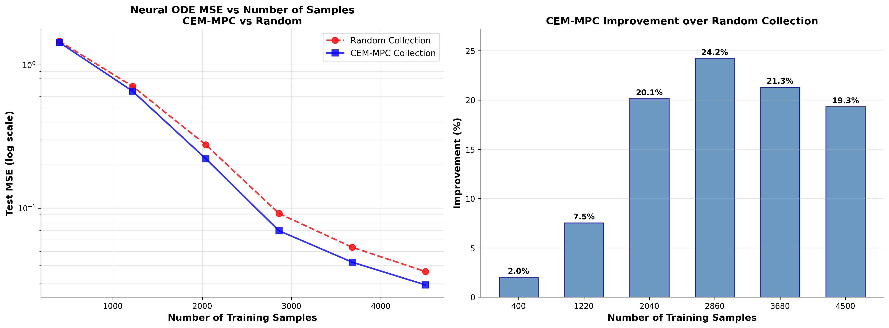

<<<<<<< HEAD
# ACUMEN: Active Cross-Entropy Method with Uncertainty-driven Neural ODEs

## Project Overview
This repository contains the implementation of **ACUMEN** (Active Cross-Entropy Method with Uncertainty-driven Neural ODEs), a data-efficient framework for system identification in healthcare. The primary goal of the project is to develop an active learning system that couples Neural Ordinary Differential Equations (Neural ODEs) with uncertainty-driven planning via the Cross-Entropy Method Model Predictive Control (CEM-MPC) to actively seek informative experiments. This enables efficient modeling of continuous-time physiological dynamics in data-limited settings, such as neuromodulation, while minimizing patient burden and ensuring safety.


**Key features include:**
- Training an ensemble of Neural ODEs to model physiological dynamics.
- Quantifying epistemic uncertainty through ensemble disagreement.
- Using CEM-MPC to select actions that maximize uncertainty, with additions like optimistic state progression, novelty terms, and adaptive scaling for balanced exploration.
- Evaluation in the Reinforcement Learning for Deep Brain Stimulation (RL-DBS) environment, demonstrating up to 24.2% improvement in mean squared prediction error over passive data collection.
- Full training, evaluation, and visualization workflow provided in multiple Jupyter notebooks, with the main implementation in `NeuralODE_CEM_MPC_Method.ipynb`.

This work was developed as part of a research project inspired by Google Summer of Code (GSoC) guidelines, focusing on advancing uncertainty-aware active learning for time-series data in healthcare.

## Contributions
### Framework Implementation
- Developed Neural ODE-based surrogate models for continuous-time system identification.
- Implemented ensemble-based epistemic uncertainty estimation.
- Created the CEM-MPC planner for uncertainty-driven exploration, including optimistic state progression and novelty-based terms.
- Added adaptive scaling for handling heterogeneous state variables and incremental retraining.
- Integrated the full iterative ACUMEN algorithm.

### Environment and Evaluation Setup
- Integrated with the RL-DBS environment for simulating neuromodulation.
- Built data collection pipelines for active (CEM-MPC) and baseline (random) exploration.
- Implemented evaluation scripts to compute MSE learning curves, per-channel uncertainty, and trajectory visualizations.


### Code and Documentation
- Modular Python codebase with models, algorithms, and utilities.
- Multiple Jupyter notebooks for interactive analysis:
  - `NeuralODE_CEM_MPC_Method.ipynb`: Main implementation of the ACUMEN framework
  - `Baseline model.ipynb`: Baseline model implementation
  - `Baseline model Epistemic Loss1.ipynb`: Epistemic uncertainty analysis
  - `Baseline model ASID.ipynb`: Alternative system identification approaches
- Example code demonstrates use of both `stable-baselines3` (PyTorch) and `stable-baselines` (TensorFlow) RL libraries.

All code is original and reproducible.

No upstream merges are applicable as this is a standalone research implementation, but the code is designed for easy integration into larger projects.

## Current State
The project is fully functional and reproduces the results reported:
- Achieves 22.5% average MSE reduction (0.002046 vs. 0.002640) and tighter uncertainty bands in the RL-DBS environment.
- Supports custom environments, hyperparameters, and extensions to other healthcare domains.
- Tested on Python 3.8+ with PyTorch; runs on standard hardware (CPU/GPU).


The repository includes:
- Multiple Jupyter notebooks containing the full code implementation:
  - `NeuralODE_CEM_MPC_Method.ipynb`: Main ACUMEN framework implementation
  - `Baseline model.ipynb`: Baseline model training and evaluation  
  - `Baseline model Epistemic Loss1.ipynb`: Epistemic uncertainty analysis
  - `Baseline model ASID.ipynb`: Alternative system identification methods
- Custom environment and C++ extension: `gym_oscillator` and `oscillator_cpp` are required for the RL-DBS environment.
- `Results/`: Generated experimental results, figures, and model weights
- Sample data generation scripts (RL-DBS datasets can be generated on-the-fly).

The work is 100% complete but open for extensions. It is usable by others for research in active learning and system identification—simply clone, install dependencies, and run the main scripts.

## Installation

### Prerequisites
- Python 3.8+
- PyTorch 1.12+ (CUDA optional for GPU)
- TensorFlow 1.x/2.x (for stable-baselines, if using PPO2)
- Dependencies: NumPy, SciPy, Matplotlib, Gym (for RL-DBS), stable-baselines3, stable-baselines
- `gym_oscillator` and the custom C++ extension `oscillator_cpp` must be installed and available in the Python path.

### Setup
Clone the repo:
```bash
git clone https://github.com/amirmmi/ACUMEN-Agentic-Sytem-ID.git
cd acumen
```

Install requirements:
```bash
pip install torch torchvision torchaudio
pip install numpy scipy matplotlib jupyter
pip install gym stable-baselines3
# Optional: stable-baselines for TensorFlow-based experiments
pip install stable-baselines tensorflow
```

Install custom environment and extension:
```bash
# Install gym_oscillator (if not already installed)
pip install git+https://github.com/dylov/rl-dbs.git  # Or your fork
# Ensure oscillator_cpp.so is built and available in the project directory
```


## Usage

The main workflow is provided in the notebook `NeuralODE_CEM_MPC_Method.ipynb`. To reproduce results:

1. Ensure all dependencies and custom environments are installed.
2. Open the notebook in Jupyter or VS Code.
3. Run all cells to train the model, evaluate, and generate plots.

Additional notebooks provide specific analyses:
- `Baseline model.ipynb`: For baseline model training and comparison
- `Baseline model Epistemic Loss1.ipynb`: For epistemic uncertainty analysis
- `Baseline model ASID.ipynb`: For alternative system identification methods

### Results
- **Learning Curves:** Lower MSE with active data, up to 24.2% improvement for >2000 samples (see notebook plots).
- **Trajectory Predictions:** Better tracking and narrower uncertainty bands.
- **Uncertainty Summary:** Per-channel reductions, 22.5% overall MSE improvement.

## Key Results

The following figure summarizes the comparison between the neural ODE CEM-MPC approach and random exploration:



## Challenges and Learnings
### Challenges
- Balancing exploration and safety in CEM-MPC to avoid aggressive actions in healthcare simulations—addressed with penalties and constraints.
- Handling irregular, noisy, heterogeneous time-series—solved using Neural ODEs' continuous-time nature and adaptive scaling.
- Computational cost of ensemble rollouts—optimized with batched ODE solves and efficient sampling.
- Ensuring reproducibility in stochastic environments like RL-DBS—used fixed seeds and detailed logging.

### Learnings
- Ensembles provide robust, calibrated uncertainty without complex Bayesian methods.
- Active learning reduces sample complexity significantly in data-scarce domains.
- Optimism and novelty enhance exploration diversity and coverage.
- Importance of modular design for research code to facilitate extensions and collaborations.

This project enhanced understanding of Neural ODEs, MPC, and active learning in healthcare AI.

## Future Work
- Combine with RL for closed-loop therapy.
- Apply to real datasets (e.g., glucose-insulin for diabetes, pharmacokinetic for anesthesia).
- Add advanced safety constraints for clinical use.
- Benchmark on additional environments.
- Community contributions for multi-modal data support.
